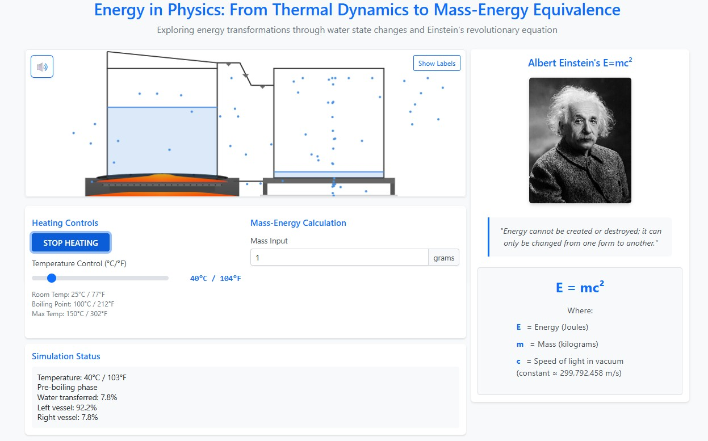

# Physics Energy Transformation Simulator

An interactive educational visualization demonstrating thermal dynamics and mass-energy equivalence through a water boiling simulation and Einstein's famous equation E=mc².



## Overview

This project provides an engaging way to understand two fundamental physics concepts:

1. **Thermal Dynamics Simulation**
   - Real-time water boiling visualization
   - Particle-based state changes (liquid → vapor → condensation)
   - Temperature-controlled phase transitions
   - Interactive heating control
   - Visual representation of molecular behavior

2. **Mass-Energy Equivalence Calculator**
   - Einstein's E=mc² equation implementation
   - Real-time energy calculations
   - Scientific notation output
   - Educational explanations of variables

## Features

### Water State Transformation
- Interactive temperature control (25°C to 150°C)
- Visual particle simulation showing molecular behavior
- Real-time phase transitions at boiling point (100°C)
- Condensation system with collection vessel
- Dynamic water level changes based on temperature
- Animated heat source visualization

### Einstein's E=mc² Calculator
- Mass to energy conversion calculator
- Scientific notation for large energy values
- Clear explanation of equation components
- Real-time updates as mass value changes
- Educational insights into mass-energy equivalence

### Technical Features
- Real-time WebSocket updates
- Particle physics simulation
- Responsive canvas rendering
- Dynamic UI updates
- Cross-browser compatibility

## Technical Requirements

- Python 3.12 or higher
- Modern web browser with WebSocket support
- Node.js (optional, for development)

## Dependencies

### Backend
```
Flask==3.0.0
Flask-SocketIO==5.3.6
python-dotenv==1.0.0
numpy==1.26.2
```

### Frontend
- Bootstrap 5.1.3
- Socket.IO Client 4.0.1

## Installation

1. Clone the repository:
```bash
git clone <repository-url>
cd physics-energy-simulator
```

2. Create and activate virtual environment:
```bash
# Windows
uv venv -p 3.12 .venv
.venv\Scripts\activate

# macOS/Linux
uv venv -p 3.12 .venv
source .venv/bin/activate
```

3. Install dependencies:
```bash
uv add -r requirements.txt
```

4. Configuration:
The application uses a default Flask secret key for development. If you need to set a custom secret key for production, you can set it via the environment variable:
```bash
# Optional: Set custom secret key
export SECRET_KEY=your_custom_secret_key
```

## Running the Application

1. Start the server:
```bash
python app.py
```

2. Access the application:
```
http://localhost:5000
```

## Project Structure

```
physics-energy-simulator/
├── core_simulation/           # Core simulation components
│   ├── app.py                # Flask application entry point
│   ├── main.py              # Main entry point
│   ├── architecture.md       # Technical architecture documentation
│   ├── requirements.txt      # Python dependencies
│   ├── pyproject.toml       # Python project configuration
│   ├── .python-version      # Python version specification
│   ├── .gitignore          # Git ignore rules
│   ├── simulation/          # Simulation logic
│   │   ├── __init__.py
│   │   ├── boiling.py       # Water boiling simulation
│   │   └── einstein.py      # E=mc² calculations
│   ├── static/             # Static assets
│   │   ├── styles.css      # Main stylesheet
│   │   ├── simulation.js   # Frontend simulation logic
│   │   ├── images/        # Image assets
│   │   │   ├── simulation_preview.jpg
│   │   │   ├── screen_shot_used.jpg
│   │   │   └── einstein.jpg
│   │   ├── styles/        # Additional stylesheets
│   │   └── audio/         # Sound effects directory
│   ├── templates/          # HTML templates
│   │   └── index.html     # Main application template
│   └── .venv/             # Virtual environment
└── public/                # Public web assets
    ├── index.html         # Main HTML entry point
    └── manifest.json      # Web app manifest
```

## Usage Guide

1. **Temperature Control**
   - Use the slider to adjust temperature (25°C - 150°C)
   - Click "Start Heating" to begin simulation
   - Watch particles change behavior with temperature

2. **Mass-Energy Calculator**
   - Enter mass value in grams
   - View real-time energy calculation
   - Results shown in scientific notation

3. **Simulation States**
   - Pre-boiling: Slow evaporation
   - Boiling point (100°C): Rapid phase change
   - Post-boiling: Increased vapor production
   - Cooling: Gradual return to initial state

## Contributing

Contributions are welcome! Please feel free to submit a Pull Request.

1. Fork the repository
2. Create your feature branch (`git checkout -b feature/AmazingFeature`)
3. Commit your changes (`git commit -m 'Add some AmazingFeature'`)
4. Push to the branch (`git push origin feature/AmazingFeature`)
5. Open a Pull Request

## License

This project is licensed under the MIT License - see the [LICENSE](LICENSE) file for details.

## Acknowledgments

- Inspired by physics education and interactive learning
- Particle simulation based on molecular dynamics principles
- Einstein's equation visualization for educational purposes

## Contact

For questions or feedback, please open an issue in the repository.

## Technical Details

### Core Components

The simulation is built on four main technical components:

1. **Simulation Controller**
   - Manages temperature states
   - Controls heating process
   - Tracks water levels
   - Coordinates all simulation updates

2. **Particle System**
   - Dynamic particle creation and destruction
   - Physics-based movement simulation
   - State change handling
   - Collision detection algorithms

3. **Render Engine**
   - Canvas-based graphics rendering
   - Real-time animation system
   - Visual effects for flame, water, and steam
   - Responsive design adaptation

4. **Physics Engine**
   - Force calculations
   - Velocity updates
   - State change management
   - Energy conservation enforcement

### Energy Calculations

The simulation implements three key energy calculation formulas:

1. **Mass-Energy Equivalence (E=mc²)**
   ```
   E = mc²
   where:
   E = Energy (Joules)
   m = Mass (kilograms)
   c = Speed of light (299,792,458 m/s)
   ```

2. **Heat Energy Transfer**
   ```
   Q = mcΔT
   where:
   Q = Heat energy
   m = Mass of water
   c = Specific heat capacity
   ΔT = Temperature change
   ```

3. **Phase Change Energy**
   ```
   E = mL
   where:
   E = Energy required
   m = Mass of substance
   L = Latent heat of vaporization
   ```

### Simulation Parameters

- Operating Temperature Range: 25°C - 150°C
- Water Boiling Point: 100°C
- Default Initial Water Level: 70%
- Dynamic Transfer Rate (temperature-dependent)
- Variable Particle Count based on state
- System Update Interval: 20ms

### Performance Optimizations

1. **Resource Management**
   - Efficient particle pooling system
   - Optimized rendering pipeline
   - State caching mechanisms
   - Batch update processing

2. **Browser Compatibility**
   - Cross-browser tested and supported
   - Responsive design implementation
   - Feature detection systems
   - Graceful fallback handling