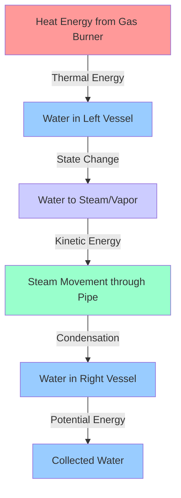
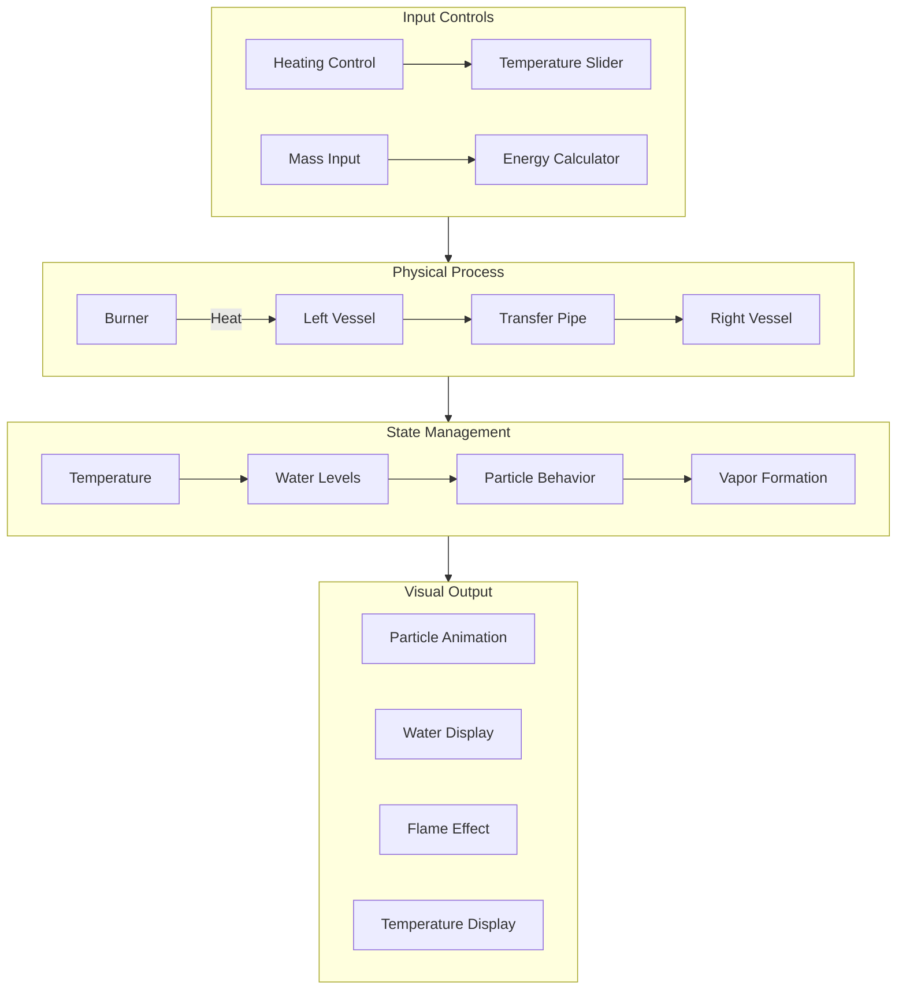
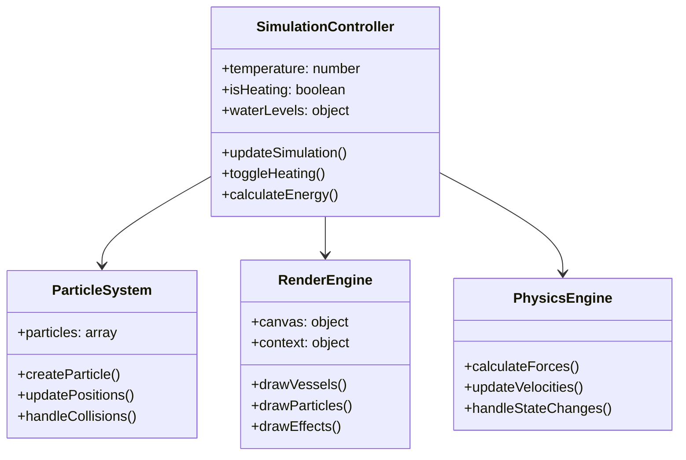

# Energy in Physics: Thermal Dynamics to Mass-Energy Equivalence
## Architecture and Technical Documentation

## Table of Contents
1. [Energy Transformation Flow](#energy-transformation-flow)
2. [Physical Principles](#physical-principles)
3. [Technical Implementation](#technical-implementation)
4. [Simulation Components](#simulation-components)
5. [User Interface](#user-interface)
6. [Calculations and Formulas](#calculations-and-formulas)

## Energy Transformation Flow

### Basic Energy Flow


### Detailed System Components


## Physical Principles

### Energy Conservation Steps
1. **Initial Heat Energy (Gas Burner)**
   - Source: Gas burner flame
   - Temperature range: 25°C to 150°C
   - Energy type: Thermal energy from combustion
   - Control: User-adjustable heating rate

2. **Water Heating Phase (Left Vessel)**
   - Initial state: Room temperature (25°C)
   - Energy absorption by water molecules
   - Increased molecular kinetic energy
   - Pre-boiling phase characteristics

3. **Phase Transition (Water to Steam)**
   - Boiling point: 100°C
   - Latent heat of vaporization
   - Breaking of molecular bonds
   - State change: Liquid to gas

4. **Steam Transport**
   - Kinetic energy of steam particles
   - Pressure-driven flow mechanics
   - Directional movement through pipe
   - Conservation of momentum

5. **Condensation Process**
   - Steam cooling in right vessel
   - Latent heat release
   - State change: Gas to liquid
   - Energy transfer to environment

6. **Final Collection**
   - Gravitational potential energy
   - Temperature equilibration
   - Mass conservation
   - System steady state

## Technical Implementation

### Core Components


### Key Technical Features
1. **Particle System**
   - Dynamic particle creation/destruction
   - Physics-based movement
   - State change handling
   - Collision detection

2. **Rendering System**
   - Canvas-based graphics
   - Real-time animation
   - Visual effects (flame, water, steam)
   - Responsive design

3. **Physics Calculations**
   - Temperature-based behavior
   - Fluid dynamics simulation
   - Energy conservation rules
   - State transition handling

4. **User Interface**
   - Interactive controls
   - Real-time feedback
   - Data visualization
   - Status indicators

## Simulation Components

### Vessel System
- Left vessel (heating)
  - Dimensions: Proportional to canvas
  - Water level monitoring
  - Temperature sensors
  - State change triggers

- Right vessel (collection)
  - Equal dimensions to left
  - Condensation handling
  - Level measurement
  - Temperature equilibration

### Heating System
- Gas burner implementation
  - Flame visualization
  - Heat distribution
  - Temperature control
  - Safety limits

### Transfer System
- Pipe mechanics
  - Flow calculation
  - Pressure handling
  - Particle transport
  - State preservation

## Calculations and Formulas

### Energy Calculations
1. **Mass-Energy Equivalence**
   ```
   E = mc²
   where:
   E = Energy (Joules)
   m = Mass (kilograms)
   c = Speed of light (299,792,458 m/s)
   ```

2. **Heat Energy**
   ```
   Q = mcΔT
   where:
   Q = Heat energy
   m = Mass of water
   c = Specific heat capacity
   ΔT = Temperature change
   ```

3. **State Change Energy**
   ```
   E = mL
   where:
   E = Energy required
   m = Mass of substance
   L = Latent heat of vaporization
   ```

### Simulation Parameters
- Temperature Range: 25°C - 150°C
- Boiling Point: 100°C
- Initial Water Level: 70%
- Transfer Rate: Temperature dependent
- Particle Count: Dynamic based on state
- Update Interval: 20ms

## Performance Considerations
1. **Optimization Techniques**
   - Particle pooling
   - Efficient rendering
   - State caching
   - Batch updates

2. **Resource Management**
   - Memory usage control
   - CPU load balancing
   - Canvas optimization
   - Event throttling

3. **Browser Compatibility**
   - Cross-browser support
   - Responsive design
   - Feature detection
   - Fallback handling 